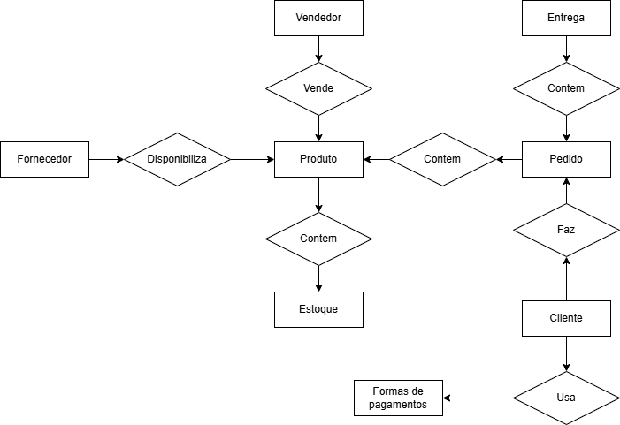
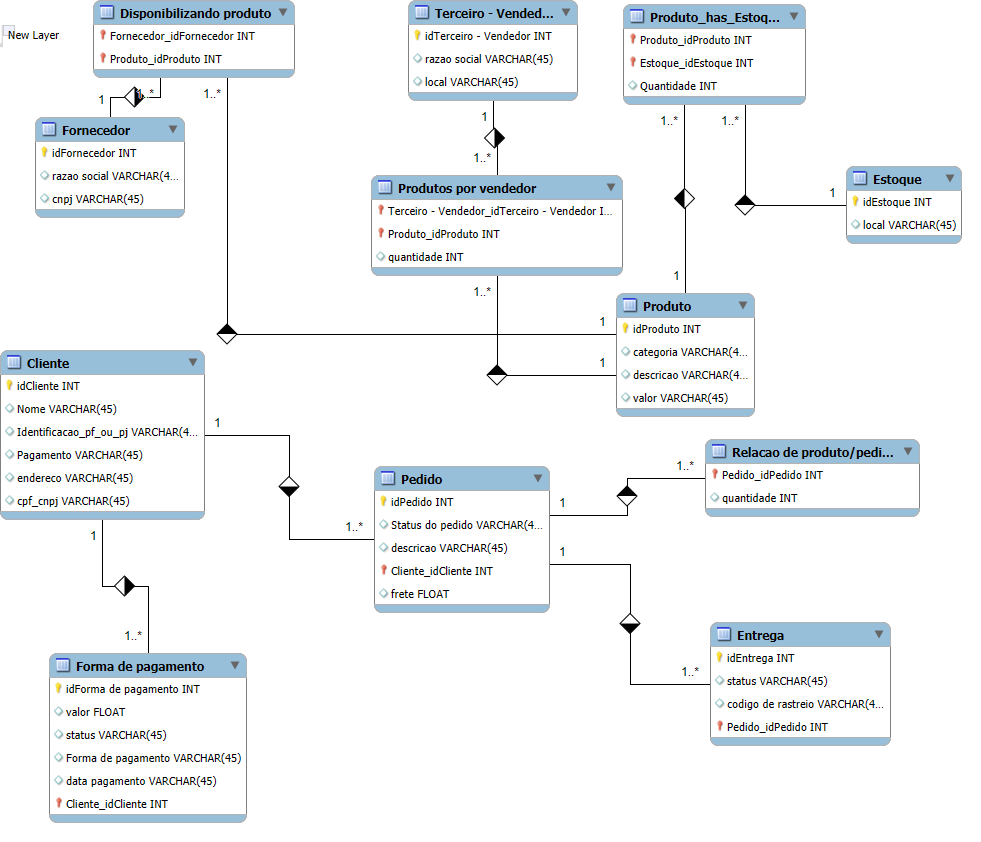

# Refinamento do Projeto de E-commerce - Bootcamp IA Aplicada a Dados com Copilot

Este projeto é uma versão refinada de um dos desafios do Bootcamp Inteligência Artificial Aplicada a Dados com Copilot da DIO. O objetivo principal foi aprimorar a modelagem do banco de dados de um sistema de e-commerce, adicionando regras mais precisas para clientes, pagamentos e entregas.

## Melhorias Implementadas
### 1. Cliente PJ e PF
 - Uma conta pode ser Pessoa Física (PF) ou Pessoa Jurídica (PJ), mas não pode ter ambas as informações.

- Foi criado um campo único cpf_cnpj para armazenar o CPF ou CNPJ, garantindo que um cliente tenha apenas um dos dois.

### 2. Pagamento
- Um cliente pode cadastrar mais de uma forma de pagamento.

- Criada uma tabela separada para pagamentos, permitindo múltiplos registros vinculados a um cliente.

- O pagamento pode ter diferentes status (pendente, pago, cancelado).

- Suporte a diferentes formas de pagamento (cartão de crédito, boleto, pix, etc.).

### 3. Entrega
- Criada uma tabela específica para entregas, associada a um pedido.

- A entrega possui status (aguardando envio, em trânsito, entregue, extraviado).

- Adicionado código de rastreamento para acompanhar o pedido.

## Tecnologias Utilizadas
- Banco de Dados Relacional MySQL 

## Diagramas
###Diagrama Conceitual

#Diagrama Lógico

